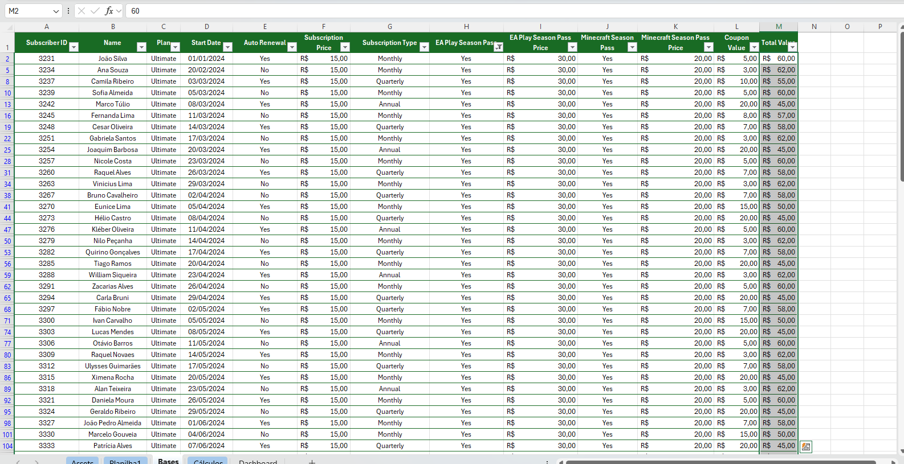
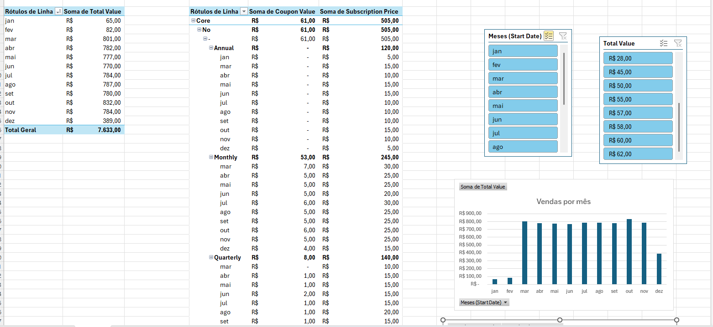
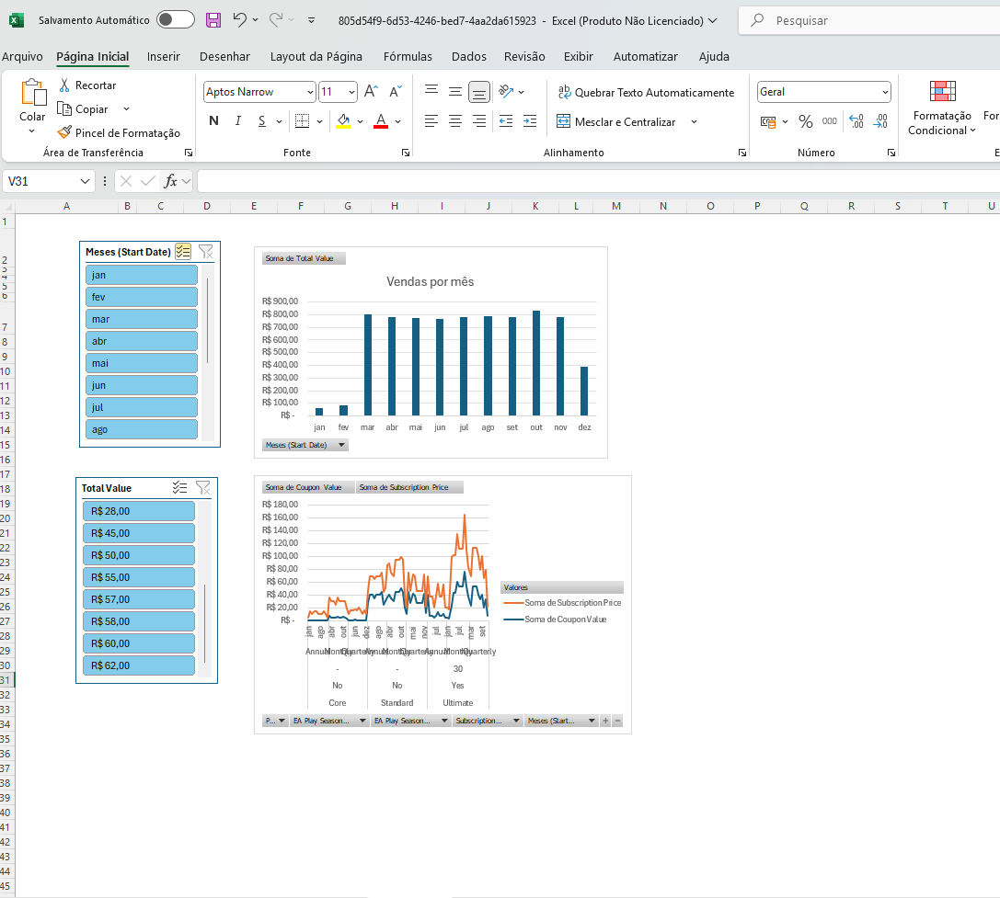

# 📊 Dashboard de Vendas - Desafio Excel

Este projeto foi desenvolvido como parte de um desafio de visualização de dados, com o objetivo de transformar uma base bruta de vendas em um dashboard interativo e informativo no Microsoft Excel.

---

## 🎯 Objetivo

Criar um dashboard de vendas que permita:
- Visualizar o desempenho mensal de vendas
- Analisar categorias como tipo de assinatura, cupons aplicados e valores totais
- Filtrar dados por mês e faixa de valor
- Facilitar a tomada de decisões com base em dados organizados e gráficos claros

---

## 📁 Estrutura do Repositório

---

## 📊 Dados Utilizados

A base de dados contém informações sobre assinaturas, incluindo:
- ID do assinante
- Nome e plano de assinatura
- Data de início
- Renovação automática
- Taxa de assinatura
- Tipo de assinatura (mensal, trimestral)
- Passes de temporada (início e meio)
- Cupons aplicados
- Valor total da assinatura

---

## 📸 Visão Geral dos Dados

### 🔍 Tabela com os Dados Brutos

---

### 📋 Tabela Dinâmica com Resumo por Categoria

---

### 📈 Dashboard Final com Gráficos Interativos

---

## 🚀 Como Usar

1. Baixe o arquivo `dashboard_final.xlsx`
2. Abra no Microsoft Excel (versão 2016 ou superior recomendada)
3. Use os filtros para explorar os dados por mês ou valor
4. Analise os gráficos para obter insights sobre desempenho de vendas

---

## 🛠️ Ferramentas Utilizadas

- Microsoft Excel
- Tabelas Dinâmicas
- Gráficos Interativos
- Segmentações de Dados
- Formatação Condicional

---

## 👨‍💻 Autor

**João Vitor Vargas** – Desenvolvedor e analista de dados em formação, apaixonado por transformar números em decisões inteligentes.

---

Feito com dedicação e foco em clareza visual 💡
